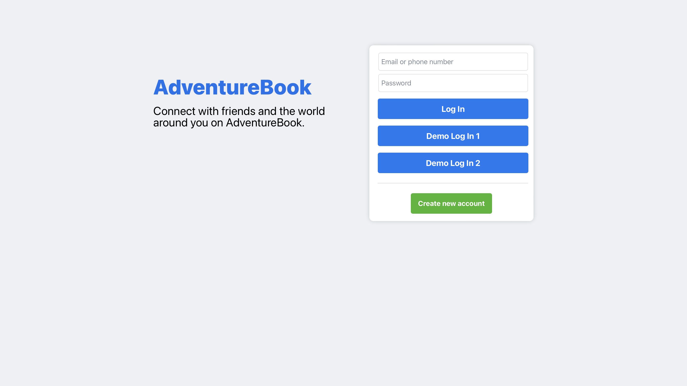

# Welcome To AdventureBook

Check out the [Live Site](https://adventure-book-56226fae6061.herokuapp.com)!

### Introduction

AdventureBook is a clone of the Facebook website designed as a platform for travelers and adventurers to document, share, and explore travel journeys. Similar to Facebook, users can sign up to create profiles, connect with others, and share their adventures through detailed posts and media. AdventureBook users can create posts, upload photos, and interact with others by liking and commenting on shared experiences. The platform also provides curated recommendations for popular travelers that you can connect to.

As someone passionate about both technology and travel, I was inspired to create AdventureBook to combine the social connectivity of Facebook with the excitement of exploring new places. This project showcases a user-friendly design that encourages interaction and sharing within a vibrant travel-focused community.

* Languages: JavaScript, Ruby, HTML, and CSS
* Frontend: React-Redux
* Database: PostgreSQL
* Asset Storage: AWS Simple Cloud Storage (S3)
* Hosting: Heroku

# Features

## User Authentication

AdventureBook provides a secure and seamless authentication system. Users can log in with existing credentials or sign up to create a new account. The system features detailed error handling to ensure data validity and a user-friendly experience.

## Profiles

AdventureBook allows users to create and customize their profiles, with data persisting across both the front and backend. Profiles form the foundation of the platform, enabling users to share their adventures and interact with others in the community.

## Posts

AdventureBook allows users to create, edit, and delete posts to share their travel experiences. Posts are saved securely in the database and are visible to other users, replicating the core functionality of Facebook's timeline.

## Comments

Users can engage with posts by adding comments. Comments are linked to the respective posts and users, enabling dynamic interaction and fostering a sense of community.

## Likes

Users can like posts to express their appreciation. The likes are stored in the database and contribute to showcasing the popularity of shared content.

## Search

AdventureBook features a powerful search functionality that enables users to find other profiles. The search system is fast, intuitive, and designed to mimic Facebook's efficient search experience.

## Friends

AdventureBook enables users to connect by sending and accepting friend requests. Once connected, friends can view each other's posts in their newsfeed, fostering a shared travel experience and building a vibrant community.

